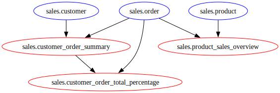

# Analytical Data Store Change Management

_Thomas Johnson_

If you have ever worked with a data warehouse/lakehouse, you've probably run into a problem where the data flowing into your data store changes structurally and you need to update table definitions for compatibility. In the case that reloading the data is cheap and easy, this isn't a big deal – you drop the existing table, create a new one with the updated schema and reload. Things aren't so simple when reloading data isn't cheap or easy, though. You may need to make manual changes to tables such as:

- You have to add a new column but not at the end of the table, so you copy to a temporary table, delete the old one, create the new table and insert into it from the temporary table
- A column type has changed from text to date, so you update the values in that column to match the standard date format and alter the column type

These kinds of manual interventions are inconvenient and introduce risks like:

- human error: an individual makes a consequential mistake that code would not
- security: the privileges required to perform these operations must be managed to avoid unauthorized access

The result of all of this is reduced productivity, greater change management burden and heightened security responsibilities. 

Another challenge you may have faced is how to organize the many views that are defined to enrich the table data. Deployments can fail if the changed files are in the wrong order, which often means there are some manual interventions in applying changes. I have seen deployment pipelines that worked around this by specifying the deployment order of SQL files in a configuration file in the repository. Merge conflicts and forgetting to add file paths to that configuration file meant that changes failed and engineers were less productive.

There is a better way to manage change in your data warehouse/lakehouse: managing table schema with migrations and the layers on top of it - views, materialized views, table functions - with a dependency graph to ensure successful deployment.

## Problem

SQL scripts that define tables, views and other objects in a database can become difficult to manage for two key reasons: (1) data and schema state, and (2) object dependencies. These reasons become impediments to efficient continuous integration and delivery (CI/CD) of database code, reducing deployment frequency and increasing change failure rates.

### Schema and Data State 

Transitioning from one schema state to another for a table is not trivial when there is data in the table: we cannot simply provide the new table definition and let the database handle getting from A to B. This creates a challenge for managing SQL code, because instead of representing the current state in our repository, the code represents the series of changes to get to the current state. 

In a world where we are spoiled by declarative tools that handle the transition from one state to another, such as Terraform (with [providers](https://developer.hashicorp.com/terraform/language/providers)) and Kubernetes (with [operators](https://kubernetes.io/docs/concepts/extend-kubernetes/operator/)), managing the transition ourselves is annoying by comparison. These tools make this possible by having a limited set of possibilities regarding how the transition can be made, while in a database the transition from one state to another isn't so simple.

### Object Dependencies

When SQL object definitions have dependencies on other objects, they need to be deployed in order. SQL databases will not handle objects provided out of order, so if you have a set of views that you are changing it will fall to the developer/operator to sort definitions to avoid deployment errors. 

These issues become apparent with deployment of SQL scripts. Managing the state of objects in a data warehouse or lakehouse requires special considerations to avoid failed changes. Consider the examples below.

## Example

### Background

Suppose we want to create a data warehouse for sales data. There is a repository with the following files.

```
/schemas
└── /sales
    ├── /tables
    │   ├── customer.sql
    │   ├── order.sql
    │   └── product.sql
    └── /views
        ├── customer_order_summary.sql
        └── product_sales_overview.sql
```

`/schemas/sales/tables/customer.sql`
```sql
CREATE TABLE sales.customer (
    id SERIAL PRIMARY KEY,
    first_name VARCHAR(50),
    last_name VARCHAR(50),
    email VARCHAR(100) UNIQUE,
    phone_number VARCHAR(20),
    address VARCHAR(255),
    city VARCHAR(50),
    state VARCHAR(50),
    zip_code VARCHAR(10),
    created_at TIMESTAMP DEFAULT CURRENT_TIMESTAMP,
    updated_at TIMESTAMP DEFAULT CURRENT_TIMESTAMP
);
```

`/schemas/sales/tables/order.sql`
```sql
CREATE TABLE sales.order (
    id SERIAL PRIMARY KEY,
    customer_id INT,
    product_id INT,
    order_date TIMESTAMP DEFAULT CURRENT_TIMESTAMP,
    quantity INT,
    total_amount DECIMAL(10, 2),
    status VARCHAR(20),
    FOREIGN KEY (customer_id) REFERENCES sales.customer(id),
    FOREIGN KEY (product_id) REFERENCES sales.product(id)
);
```

`/schemas/sales/tables/product.sql`
```sql
CREATE TABLE sales.product (
    id SERIAL PRIMARY KEY,
    product_name VARCHAR(100),
    category VARCHAR(50),
    price DECIMAL(10, 2),
    stock_quantity INT,
    created_at TIMESTAMP DEFAULT CURRENT_TIMESTAMP,
    updated_at TIMESTAMP DEFAULT CURRENT_TIMESTAMP
);
```

`/schemas/sales/views/customer_order_summary.sql`
```sql
CREATE VIEW sales.customer_order_summary AS
SELECT 
    c.id,
    c.email,
    COUNT(o.order_id) AS total_orders,
    SUM(o.total_amount) AS total_spent,
    MAX(o.order_date) AS last_order_date
FROM 
    sales.customer c
LEFT JOIN 
    sales.order o ON c.customer_id = o.id
GROUP BY 
    c.id, c.first_name, c.last_name, c.email
ORDER BY total_orders DESC;
```

`/schemas/sales/views/product_sales_overview.sql`
```sql
CREATE VIEW sales.product_sales_overview AS
SELECT 
    p.id,
    p.product_name,
    p.category,
    COUNT(o.order_id) AS total_orders,
    SUM(o.quantity) AS total_quantity_sold,
    SUM(o.total_amount) AS total_sales_amount,
    p.stock_quantity AS current_stock
FROM 
    sales.product p
LEFT JOIN 
    sales.order o ON p.product_id = o.product_id
GROUP BY 
    p.product_id, p.product_name, p.category, p.stock_quantity;
```

### Initial Deployment

Making the initial deployment with this set of files is challenging because they must be deployed in the following order due to their interdependencies:

```
# customer and product don't have any dependencies, so either one can come first
/schemas/sales/tables/customer.sql
/schemas/sales/tables/product.sql

# the order table depends on both customer and product, so it can only be deployed after them
/schemas/sales/tables/order.sql

# And the views can be in either order:
/schemas/sales/views/customer_order_summary.sql
/schemas/sales/views/product_sales_overview.sql
```

So from the start we are running into the object dependency issue, which means deployment - whether automatic or manual - needs to account for this.

### Table Changes

Let's assume that we were able to get everything deployed. Now we want to add a `product_category` table and modify the `product` table by adding a `product_category_id` column that references the `id` column in `product_category`. In an ideal world, we could simply add a new SQL file that defines `product_category` and updates the `product` definition and the databse would figure out how to handle that. There is already data in the `product` table though, so we need to make sure that we don't lose it. We also have another dependency issue, as `product_category.sql` will come before `product.sql`, but we'll ignore this for now.

The updated `sales.product` table would be defined as:

```sql
CREATE TABLE sales.product (
    id SERIAL PRIMARY KEY,
    product_name VARCHAR(100),
    product_category_id INT,
    price DECIMAL(10, 2),
    stock_quantity INT,
    created_at TIMESTAMP DEFAULT CURRENT_TIMESTAMP,
    updated_at TIMESTAMP DEFAULT CURRENT_TIMESTAMP,
    FOREIGN KEY (product_category_id) REFERENCES sales.product_category(id)
);
```

This new definition can't be applied as is, we have to tell the database how to transition from the existing definition to this one.

The new table `sales.product_category` can be defined as:

`/schemas/sales/tables/product_category.sql`
```sql
CREATE TABLE sales.product_category (
    id SERIAL PRIMARY KEY,
    name VARCHAR(50)
);
```

The data for this table can be taken from the existing `sales.product` table:

```sql
INSERT INTO sales.product_category (category) 
SELECT DISTINCT category FROM sales.product;
```

Now the `sales.product` table can be modified to establish the foreign key relation:

```sql
ALTER TABLE sales.products 
DROP COLUMN category;

ALTER TABLE sales.products 
ADD COLUMN product_category_id INT,
ADD CONSTRAINT fk_product_category
    FOREIGN KEY (product_category_id) 
    REFERENCES sales.product_category(id);
```

What do we learn from this? Well, we won't be able to rely on a repository structure that only represents the current state of table definitions but instead how to transition from one state to another. To do this, we can make use of **migrations**. 

#### Migrations Example

A simple example of a migration system in this case could be a series of files like this:

```
/deploy
├── 001_initial_tables.sql
├── 002_product_category.sql
├── 003_product_category_description.sql
/revert
├── 001_initial_tables.sql
├── 002_product_category.sql
└── 003_product_category_description.sql
```

With the following contents for the deploy directory:

`/deploy/001_initial_tables.sql`
```sql
CREATE TABLE sales.product (
...
);

CREATE TABLE sales.customer (
...
);

CREATE TABLE sales.order (
...
);
```

`/deploy/002_product_category.sql`
```sql
CREATE TABLE sales.product_category (
    id SERIAL PRIMARY KEY,
    name VARCHAR(50)
);

INSERT INTO sales.product_category (category) 
SELECT DISTINCT category FROM sales.product;

ALTER TABLE sales.products 
DROP COLUMN category;

ALTER TABLE sales.products 
ADD COLUMN product_category_id INT,
ADD CONSTRAINT fk_product_category
    FOREIGN KEY (product_category_id) 
    REFERENCES sales.product_category(id);
```

`/deploy/003_product_category_description.sql`
```sql
ALTER TABLE sales.product_category ADD COLUMN description TEXT;
```

and the following contents for the revert directory:

`/revert/001_initial_tables.sql`
```sql
DROP TABLE sales.order;

DROP TABLE sales.customer;

DROP TABLE sales.product;
```

`/revert/002_product_category.sql`
```sql
ALTER TABLE sales.product ADD COLUMN category VARCHAR(50);

UPDATE TABLE sales.product 
JOIN sales.product_category 
ON product.product_category_id = product_category.id
SET COLUMN product.category = product_category.name;

ALTER TABLE sales.products 
DROP CONSTRAINT fk_product_category;

ALTER TABLE sales.products 
DROP COLUMN product_category_id;

DROP TABLE sales.product_category;
```

`/revert/003_product_category_description.sql`
```sql
ALTER TABLE sales.product_category DROP COLUMN description;
```

To deploy changes, simply run the files in the deploy folder in order. To revert to a prior state, run the files in the revert folder that correspond to the changes you want to revert from the deploy folder. One part of migration systems left out of this example is using a table in the database to track what migrations have already been applied so that only new migrations are applied on subsequent runs.

### View Changes

We saw the interdependency issue in the table definition code, and it is also the problem with maintaining SQL view code. Why don't we use migrations for views too? Using migrations for managing SQL views would mean that changes to the view definition would have to be tracked in different files. With all of the complex logic that views can contain, it's critical that we are able to see the changes from one version to another in the same file. Fortunately, views do not have the data state constraint that tables do, so as long as we deploy them in order of their dependency chain we do not have risks with creating problems with our data. 

Let's consider the views in the example. Suppose we want a view that calculates the percentage of sales that a customer's order makes up of their total sales:

`/schemas/sales/views/customer_order_total_percentage.sql`
```sql
CREATE VIEW sales.customer_order_total_percentage AS
SELECT 
    order.id,
    email,
    order.total_amount,
    total_spent,
    100 * order.total_amount / total_spent AS order_total_percentage
FROM sales.customer_order_summary
JOIN sales.order
    ON customer_order_summary.order_id = order.id;
```

If the `sales.customer_order_summary` view is already deployed, the `sales.customer_order_total_percentage` view can be simply deployed. We then decide that we want to identify users by their name rather than their email, so we change the underlying view:

```sql
CREATE OR REPLACE VIEW sales.customer_order_summary AS
SELECT 
    c.id,
    CONCAT(c.first_name, ' ', c.last_name) AS customer_name,
    c.email,
    COUNT(o.order_id) AS total_orders,
    SUM(o.total_amount) AS total_spent,
    MAX(o.order_date) AS last_order_date
FROM 
    sales.customer c
LEFT JOIN 
    sales.order o ON c.customer_id = o.id
GROUP BY 
    c.id, c.first_name, c.last_name, c.email
ORDER BY total_orders DESC;
```

and we update the `sales.customer_order_total_percentage` view:

```sql
CREATE OR REPLACE VIEW sales.customer_order_total_percentage AS
SELECT 
    order.id,
    customer_name,
    order.total_amount,
    total_spent,
    100 * order.total_amount / total_spent AS order_total_percentage
FROM sales.customer_order_summary
JOIN sales.order
    ON customer_order_summary.order_id = order.id;
```

To deploy these changes, we need to make sure that `sales.customer_order_total_percentage` is deployed after `sales.customer_order_summary`. So if we don't want to make use of migrations to handle views but we also want to be able to deploy them without having to worry about ordering their deployment, what can we do? Create a **dependency graph**.

#### Dependency Graph Example

In order to identify the objects that a view depends on, we will make a slight change to how we write SQL. We will add `@@` at the beginning and end of table and view names to identify them in the files. For example, in the `sales.customer_order_total_percentage` view:

```sql
CREATE OR REPLACE VIEW sales.customer_order_total_percentage AS
SELECT 
    order.id,
    customer_name,
    order.total_amount,
    total_spent,
    100 * order.total_amount / total_spent AS order_total_percentage
FROM @@sales.customer_order_summary@@
JOIN @@sales.order@@
    ON customer_order_summary.order_id = order.id;
```

Then we can use the regular expression `@@[a-z.0-9_^@]+@@` to get the table and view identifiers and construct a dependency graph:

```python
import re
from typing import List
import networkx as nx

view_files = [
    "./schemas/sales/views/customer_order_summary.sql",
    "./schemas/sales/views/product_sales_overview.sql",
    "./schemas/sales/views/customer_order_total_percentage.sql",
]

table_files = [
    "./schemas/sales/tables/customer.sql",
    "./schemas/sales/tables/product.sql",
    "./schemas/sales/tables/order.sql",
]


def get_table_name(sql: str) -> str:
    match = re.search(
        r"CREATE\W+(OR\W+REPLACE\W+)?TABLE\W+(?P<table_name>[a-zA-Z0-9_.]+)",
        sql,
    )
    return match.group("table_name") if match else None


def get_view_name(sql: str) -> str:
    match = re.search(
        r"CREATE\W+(OR\W+REPLACE\W+)?VIEW\W+(?P<view_name>[a-zA-Z0-9_.]+)", sql
    )
    return match.group("view_name") if match else None


def get_identifiers(sql: str) -> List[str]:
    matches = re.findall(r"@@[a-z.0-9_^@]+@@", sql)
    return [match.replace("@@", "") for match in matches]


def quote(text: str) -> str:
    return f'"{text}"'


color_map = {"table": "blue", "view": "red"}


def generate_dependency_graph(
    table_sql: List[str], view_sql: List[str]
) -> nx.DiGraph:
    table_names = [get_table_name(sql) for sql in table_sql]

    graph = nx.DiGraph()

    for sql in view_sql:
        view_name = get_view_name(sql)
        node_type = "table" if view_name in table_names else "view"
        graph.add_node(
            quote(view_name), type=node_type, color=color_map[node_type]
        )
        for identifier in get_identifiers(sql):
            node_type = "table" if identifier in table_names else "view"
            graph.add_node(
                quote(identifier), type=node_type, color=color_map[node_type]
            )
            graph.add_edge(quote(identifier), quote(view_name))

    return graph


def read_file(path: str) -> str:
    with open(path, "r") as f:
        return f.read()


if __name__ == "__main__":
    table_sql = [read_file(sql) for sql in table_files]
    view_sql = [read_file(sql) for sql in view_files]
    graph = generate_dependency_graph(table_sql, view_sql)
    nx.nx_pydot.to_pydot(graph).write_svg("./graph.svg")
    # Remove tables
    graph.remove_nodes_from(
        [node for node in graph.nodes if graph.nodes[node]["type"] == "table"]
    )
    # Generate deployment order
    print("Deployment order of views:")
    for view in nx.topological_sort(graph):
        print(view)

```

Generating this dependency graph with tables in red and views in blue:



and this deployment order:

```
Deployment order:
"sales.customer_order_summary"
"sales.product_sales_overview"
"sales.customer_order_total_percentage"
```

## Conclusion

Any solution to this problem must account for the following constraints:

- Transitioning from one schema state to another without error or corrupting data
- Objects deploy in the correct order of their interdependency
- Analytical SQL code, such as views, is productively managed in source control

Combining migrations for the table schema with a system that manages the dependency graph for the layer on top of that is the answer. Migrations solve the issue of how to transition from one schema and data state to another, but fail to make managing the analytical layer easy. That's where tooling that understands the dependency graph between objects in the analytical layer comes in. Let's talk tools.

### Migration Tools

Three migration tools I have worked with are [Liquibase](https://www.red-gate.com/products/flyway/), [Sqitch](https://sqitch.org/) and [Flyway](https://www.liquibase.com/). There are also other options out there. All of these tools have different features and styles, but the broader concept of migrations is the same. Here's a table with a breakdown of database support by migration tool for common analytical databases:

| Database       | [Liquibase Support](https://www.liquibase.com/supported-databases) | [Sqitch Support](https://sqitch.org/docs/manual/sqitch/) | [Flyway Support](https://www.red-gate.com/products/flyway/community/) |
|----------------|-------------------|----------------|----------------|
| **PostgreSQL** | Yes | Yes | Yes |
| **Snowflake**  | Yes | Yes | Yes |
| **BigQuery**   | Yes | No  | Yes |
| **Databricks** | Yes | No  | Yes |
| **Teradata**   | Yes | No  | No  |
| **Redshift**   | Yes | No  | Yes |
| **Clickhouse** | Yes | No  | No  |

Each of these support plenty of other databases not mentioned in this table, so check the documentation for more information.

### Dependency Graph Management

There are a few tools that manage the layer of SQL objects above tables: [dbt](https://www.getdbt.com/), [sqlmesh](https://sqlmesh.readthedocs.io/en/stable/), and [SDF](https://www.sdf.com/). 

Here's an abridged table showing database support:

| Database       | [dbt](https://docs.getdbt.com/docs/trusted-adapters) | [sqlmesh](https://sqlmesh.readthedocs.io/en/stable/integrations/overview/#execution-engines) | [sdf](https://docs.sdf.com/integrations/overview) |
|----------------|-------------------|----------------|----------------|
| **PostgreSQL** | Yes | Yes | No  |
| **BigQuery**   | Yes | Yes | Yes |
| **Snowflake**  | Yes | Yes | Yes |
| **Athena**     | Yes | No  | No  |
| **Trino**      | Yes | Yes | No  |
| **Redshift**   | Yes | Yes | Yes |
| **Teradata**   | Yes | No  | No  |
| **DuckDB**     | Yes | Yes | No  |

dbt supports most databases due to how it works, while sqlmesh and sdf support much smaller sets. 

## Stray Thoughts

### sqlglot

If you are working with a large amount of SQL code, [sqlglot](http://sqlglot.com/) is your swiss army knife. I think within a few months/years it will start showing up on job descriptions and resumes. It is also the backbone of sqlmesh and supports a broader range of SQL dialects than sqlmesh. As a tool that makes looking at a massive codebase of SQL a lot less daunting and a lot more manageable, sqlglot is a reprieve for many a software/data engineer.

### Migrations

Migrations are a simplistic instrument when it comes to managing database schema, but we get reliability and broad flexibility with them. I have seen companies that managed table definitions based on JSON files that had additional configuration information. These were always less expressive than the SQL DDL and inevitably there would be some change that required a manual workaround to the JSON file strategy. Additionally, handling the changes between versions of a JSON file fell to the deployment pipeline, which was written like it wasn't intended to do that in the first place. Migrations don't have that problem.

## Useful Links

1. https://www.liquibase.com/resources/guides/database-deployment
2. https://tobikodata.com/semantic-understanding-of-sql.html
3. https://sqitch.org/about/